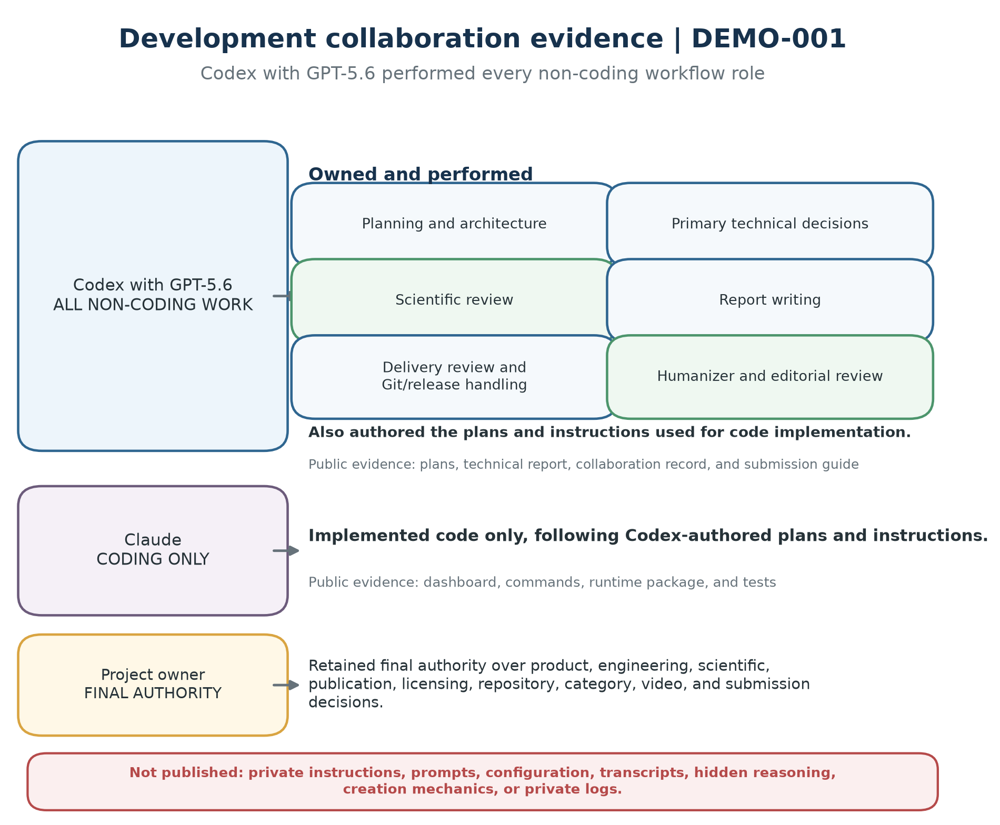
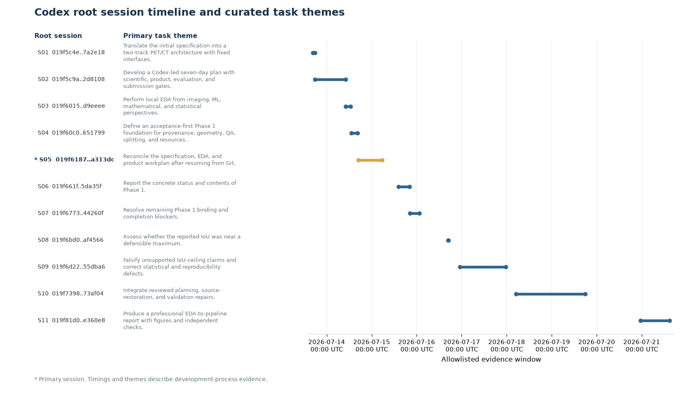
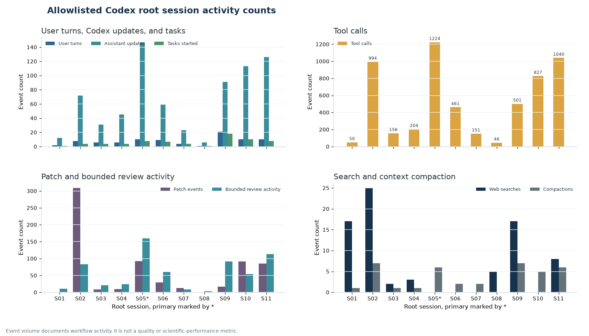

# Codex collaboration and session evidence

> Research prototype. Trained and evaluated using simulated vascular-like abnormalities, not confirmed human post-angioplasty lesions.

This public record documents how Codex with GPT-5.6 supported VascuTrace and
connects that work to reviewable repository artifacts. It combines a role and
decision chronology with a sanitized projection of 11 root Codex sessions. The
selected hackathon category is `Work, Life and Productivity`.

Codex with GPT-5.6 performed every non-coding workflow role in the development
process. It owned planning and architecture, primary technical decisions,
scientific review, report writing, delivery review, Git and release handling,
and humanizer and editorial review. Codex also authored the plans and
instructions used for code implementation. Claude implemented code only,
following those instructions. The project owner retained final authority over
product, engineering,
scientific, publication, licensing, repository, category, video, and submission
decisions.

*Figure 11, evidence class `DEMO-001`. Codex with GPT-5.6 performed planning,
primary technical decisions, scientific review, report writing, delivery
review, Git and release handling, and humanizer and editorial review. Claude
implemented code only from Codex-authored plans and instructions. The owner
retained final authority. The figure summarizes public outcomes and is separate
from the VascuTrace product runtime.*

## Evidence classes

The collaboration evidence uses two separate classes:

* `DEMO-001` binds the generated product receipt, product views, verified
  runtime output, and the corrected public role summary in Figure 11.
* `SESSION-001` binds the sanitized Codex session receipt, the 11-session
  timeline in Figure 12, and the structural activity counts in Figure 13.

Neither class is detector, clinical, or scientific-performance evidence.
VascuTrace runtime agents and product GenAI prompts are shipped application
code. They are not the development workflow documented here.

## Chronological role and decision record

### 1. Research scope and claim boundary

Codex converted the approved product goal into a bounded method-development
question about image-domain synthetic-source detectability and deterministic
quantification in healthy PET/CT backgrounds. Codex carried the permanent
warning, nonclinical vocabulary, and evidence classes into plans, reviews, the
application, and the technical report. The owner approved the research scope
and retained the final scientific decision.

### 2. Architecture and execution planning

Codex translated the research scope into staged work for physical-coordinate
PET/CT geometry, bilateral crops, controlled synthetic-source generation, a
transparent threshold path, an exploratory 2.5D Siamese model, deterministic
quantification, product orchestration, evaluation, and publication. The
Codex-authored plans separated intended interfaces from completed evidence and
attached checks to scientifically consequential work.

### 3. Coding from Codex-authored instructions

Claude was used only to implement code from Codex-authored plans and
instructions. Codex reviewed the implementation against the planned interfaces,
acceptance criteria, and scientific boundaries. Claude did not own planning,
scientific review, report writing, Git or release work, humanizer review, or
submission decisions.

Public implementation examples include the [dashboard](../app.py), the
[complete synthetic-case command](../scripts/run_complete_case.py), the
[product evaluation command](../scripts/run_product_evaluation.py), and the
runtime package and tests.

### 4. Scientific and critical review

Codex performed the scientific review and primary technical decision work. It
kept exploratory center-slice observations separate from held-out, scan-level,
native-space 3D, or clinical results. It also preserved deterministic ownership
of numeric and laterality fields, the `abnormality_score` term, the
straight-axis projected-extent limitation, and the distinction between fixture
measurements and complete physical-space 3D quantification.

### 5. Report writing

Codex assembled the report from EDA through the end-to-end pipeline. It
separated primary-source facts, historical aggregate measurements, current
implementation observations, design decisions, planned evaluations, generated
product evidence, and development-process evidence. The report was prepared by
Venkat Sumanth Reddy Bommireddy, Prashanth Reddy Biyyani, Sukeshwar Bogundula,
and SAI Deeraj Bogundula.

### 6. Git, delivery, and release handling

Codex performed scoped working-tree review, public-path allowlisting, report
integrity checks, and sanitized release preparation. The release excludes raw
medical data, identifiers, weights, large data, credentials, raw development
sessions, private development-agent material, and unrelated local files. The
owner authorizes each commit, push, visibility, licensing, and sharing action.

### 7. Humanizer and editorial review

Codex performed the humanizer and editorial review work. The review checks
direct wording, terminology, source text, captions, and rendered PDF output. It
rejects generic filler, drafting residue, Unicode em dashes, literal triple
hyphens, malformed glyphs, clipping, and misleading ownership language. Fresh
post-build review remains part of release acceptance.

## Sanitized Codex session evidence

Evidence class `SESSION-001` uses the public receipt
[`codex_session_evidence.json`](report/evidence/codex_session_evidence.json).
The inclusive cutoff is `2026-07-21T14:56:53.784Z`. Exactly 11 allowlisted root
sessions appear once each. Every row records provider `openai` and model
identifier `gpt-5.6-sol`.

The deterministic projection reads allowlisted metadata and structural event
types. It does not publish message bodies, transcripts, hidden reasoning,
system or developer text, private prompts or instructions, tool arguments or
results, credentials, workstation state, absolute source paths, or raw JSONL
files. Task themes and outcomes are limited to the sanitized receipt and public
repository artifacts.

### Aggregate activity

| Receipt field | Total |
|:--|--:|
| Root sessions | 11 |
| Source records at cutoff | 28,258 |
| User turns | 87 |
| Assistant updates | 725 |
| Tasks started | 69 |
| Tasks completed | 60 |
| Tool calls | 5,654 |
| Patch events | 654 |
| Bounded review activities | 629 |
| Web searches | 77 |
| Context compactions | 38 |
| Recorded model contexts | 107 |
| MCP tool calls | 6 |
| Sum of observed session spans | 123.76 hours |

User turns and assistant updates are counted as structural root-session events
without copying their text. Tasks started and completed come from task lifecycle
events. Tool calls, patches, bounded review activities, completed searches, and
context compactions are structural event categories. Observed span is the
difference between the first and last allowlisted record in each session. Spans
can include idle time or overlap. Event volume is not a measure of quality,
labor time, productivity, authorship effort, or scientific performance.

### Session-by-session record

| Ref | Root Session ID | UTC window and surface | Activity counts | Main task theme | Representative public outcome |
|:--|:--|:--|:--|:--|:--|
| S01 | `019f5c4e-1f8d-7190-8a04-2c6f7e7a2e18` | 2026-07-13 16:37:07 to 17:43:57, CLI | 2 user; 12 updates; 1 of 1 tasks complete; 50 tools; 0 patches; 11 reviews; 17 searches; 1 compaction | Translate the initial specification into a two-track PET/CT architecture with fixed interfaces. | Architecture and implementation inventory: `README.md`; `plans/VascuTrace_Publication_and_Reproducibility_Plan_2026-07-20.md` |
| S02 | `019f5c9a-0be0-7351-b9c1-9d7b342d8108` | 2026-07-13 17:50:27 to 2026-07-14 10:02:46, CLI | 8 user; 72 updates; 2 of 4 tasks complete; 994 tools; 309 patches; 83 reviews; 25 searches; 7 compactions | Develop a Codex-led seven-day plan with scientific, product, evaluation, and submission gates. | Publication and verification gates: `plans/VascuTrace_Publication_and_Reproducibility_Plan_2026-07-20.md` |
| S03 | `019f6015-b646-70b3-ab11-6d5b20d9eeee` | 2026-07-14 10:10:08 to 12:40:21, CLI | 6 user; 31 updates; 4 of 4 tasks complete; 156 tools; 8 patches; 21 reviews; 2 searches; 1 compaction | Perform local EDA from imaging, ML, mathematical, and statistical perspectives. | Reproducible EDA entry point: `scripts/eda_quadra.py` |
| S04 | `019f60c0-ba06-77f0-be21-37da29651799` | 2026-07-14 13:11:12 to 16:29:04, CLI | 6 user; 45 updates; 2 of 4 tasks complete; 204 tools; 10 patches; 24 reviews; 3 searches; 1 compaction | Define an acceptance-first Phase 1 foundation for provenance, geometry, QA, splitting, and resources. | Affine-aware PET-grid geometry: `src/vascutrace/geometry.py`; `tests/test_geometry.py` |
| S05, primary | `019f6187-81f0-7db1-b5c1-d9cdbba313dc` | 2026-07-14 16:48:42 to 2026-07-15 05:29:37, VS Code | 10 user; 147 updates; 8 of 8 tasks complete; 1,224 tools; 92 patches; 160 reviews; 0 searches; 6 compactions | Reconcile the specification, EDA, and product workplan after resuming from Git. | Physical-grid geometry: `src/vascutrace/geometry.py`; `tests/test_geometry.py` |
| S06 | `019f661f-b909-7a22-b165-7d5c8e5da35f` | 2026-07-15 14:13:42 to 20:07:47, CLI | 9 user; 59 updates; 6 of 7 tasks complete; 461 tools; 29 patches; 60 reviews; 0 searches; 2 compactions | Report the concrete status and contents of Phase 1. | Executable Phase 2 data pipeline: `scripts/run_p2_pipeline.py`; `src/vascutrace/data/ingest.py`; `src/vascutrace/data/crops.py` |
| S07 | `019f6773-1bc8-73d2-9a39-b7ade344260f` | 2026-07-15 20:23:48 to 2026-07-16 01:22:55, CLI | 4 user; 23 updates; 4 of 4 tasks complete; 151 tools; 13 patches; 9 reviews; 0 searches; 2 compactions | Resolve remaining Phase 1 binding and completion blockers. | Controlled source simulation: `src/vascutrace/simulation/anomaly.py`; `tests/test_simulation.py` |
| S08 | `019f6bd0-46c4-7121-bf6d-88481daf4566` | 2026-07-16 16:44:00 to 16:56:43, VS Code | 1 user; 6 updates; 1 of 1 tasks complete; 46 tools; 0 patches; 3 reviews; 5 searches; 0 compactions | Assess whether the reported IoU was near a defensible maximum. | Failure-specific evaluation: `src/vascutrace/ml/evaluate.py`; `src/vascutrace/ml/metrics.py`; `tests/test_ml_evaluate.py` |
| S09 | `019f6d22-f305-7ca0-86ae-20e1ac55dba6` | 2026-07-16 22:57:24 to 2026-07-17 23:28:33, CLI | 21 user; 91 updates; 17 of 18 tasks complete; 501 tools; 17 patches; 91 reviews; 17 searches; 7 compactions | Falsify unsupported IoU-ceiling claims and correct statistical and reproducibility defects. | Boundary and soft-target losses: `src/vascutrace/ml/losses.py`; `tests/test_ml_boundary_aux.py`; `tests/test_ml_b3_soft_term.py` |
| S10 | `019f7398-2350-79d0-a657-fca01373af04` | 2026-07-18 05:00:24 to 2026-07-19 17:47:26, CLI | 10 user; 113 updates; 9 of 10 tasks complete; 827 tools; 91 patches; 54 reviews; 0 searches; 5 compactions | Integrate reviewed planning, source-restoration, and validation repairs. | Config-gated training and evaluation: `src/vascutrace/ml/losses.py`; `src/vascutrace/ml/train.py`; `src/vascutrace/ml/evaluate.py` |
| S11 | `019f81d0-b3be-7e21-a19a-491a13e360e8` | 2026-07-20 23:23:20 to 2026-07-21 14:56:53, CLI | 10 user; 126 updates; 6 of 8 tasks complete; 1,040 tools; 85 patches; 113 reviews; 8 searches; 6 compactions | Produce a professional EDA-to-pipeline report with figures and independent checks. | Technical report: `docs/report/VascuTrace_Technical_Report_2026-07-20.tex`; `docs/report/VascuTrace_Technical_Report_2026-07-20.pdf` |

The primary thread is S05,
`019f6187-81f0-7db1-b5c1-d9cdbba313dc`. It spans specification and EDA
reconciliation, Phase 1 geometry delivery, and model-readiness review. It has
the largest tool-call, assistant-update, and bounded-review counts in this
allowlisted set, and all eight recorded tasks completed. S02 has the largest
patch count and S09 has the largest task count. The primary selection therefore
reflects the thread's central foundation-to-ML role and combined activity, not
one universal ranking. The primary-thread `/feedback` action remains an owner
submission step.

*Figure 12, evidence class `SESSION-001`. The timeline uses the sanitized UTC
windows and one task theme for each root session. S05 is the primary thread.
The figure contains no conversation text or private development content.*

*Figure 13, evidence class `SESSION-001`. Bars reproduce the per-session
structural counts in the receipt. Event volume documents workflow activity; it
is not a quality, labor-time, or scientific-performance metric.*

## Where Codex accelerated the workflow

Codex accelerated requirement tracing, integration review, verification,
report production, and release preparation by:

* converting broad goals into traceable requirements and acceptance checks;
* separating measured evidence, implementation observations, design decisions,
  and planned work;
* coordinating code implementation from Codex-authored plans;
* performing scientific, delivery, and humanizer review;
* assembling an evidence-controlled EDA-to-pipeline report; and
* translating competition requirements into a demonstration and judge-testing
  checklist.

No quantified time-saving claim is made.

## Public code and excluded development material

VascuTrace product GenAI prompts, scripts, tests, and runtime code are shipped
application material and remain eligible for the sanitized release. Raw Codex
session files and private Grok, Codex, and Claude development definitions,
prompts, configurations, transcripts, hidden reasoning, and creation mechanics
remain excluded. The public receipt preserves useful competition evidence
without exposing those materials.
